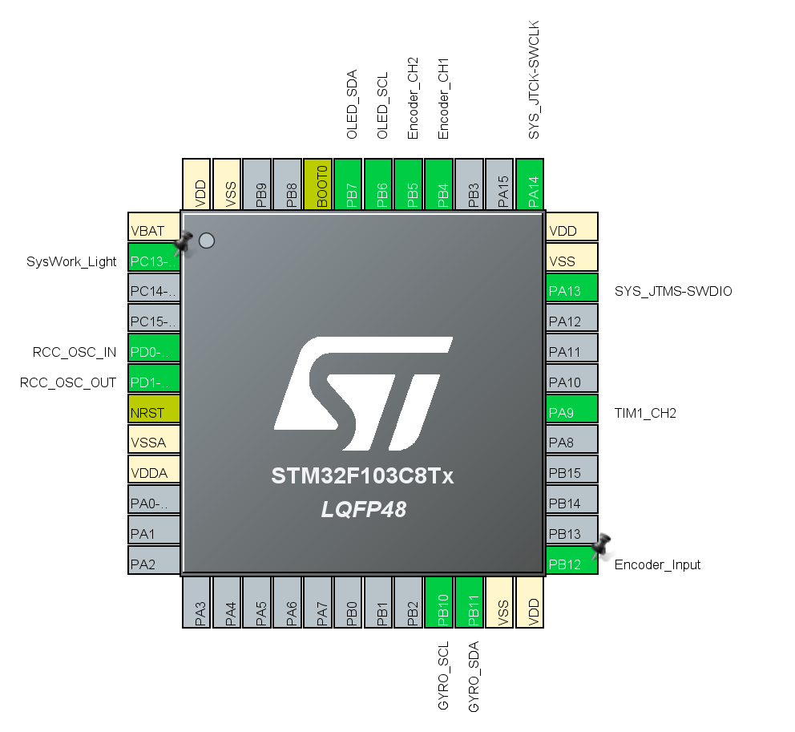

- これは我的第一个STM工程！
- 使用STM的CUBEIDE配置的底层代码(型号为STM32C8T6)
- oled配置是SSD1315|SSD1306，分辨率是128X64
- 目前支持像lua一样的tween补全,他们的语法相似(而且他们可以在while里面被调用!不会造成多次触发Tween)
- 其实tween的灵感来源于psych engine 233
- oled的ui部分还需要灵感
- 使用C语言完成
- 目前可以游玩小游戏了
- 