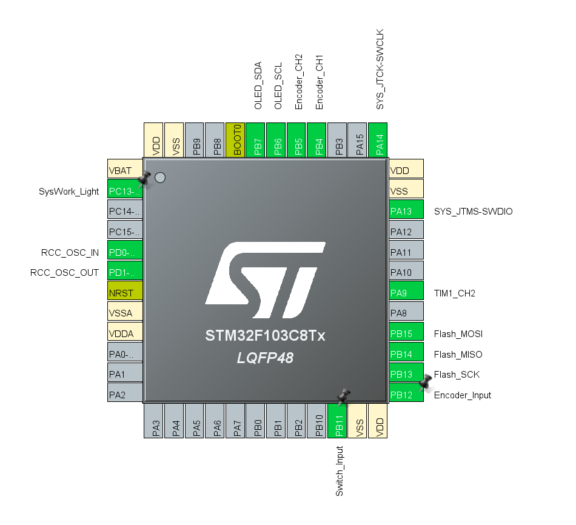

## これは我的第一个STM工程(写的很糟见谅233)！
- __目前支持像lua一样的tween补全,他们的语法相似(而且有逻辑判断可以在while里面被调用!不会造成多次触发Tween导致的不正常)__
- __目前支持贪吃蛇、2048游戏、视频播放功能 还有部分菜单功能__
- __支持多级菜单__

### 型号和设计
- 使用STM的CUBEIDE配置的底层代码(型号为STM32C8T6)
- OLED配置是SSD1315|SSD1306，分辨率是128X64
- OLED的ui部分还需要灵感来发挥tween的强大233
- 使用C语言来完成主体部分
- _其实tween的灵感来源于psych engine_
- _还需要挺长的维护的233_
- 