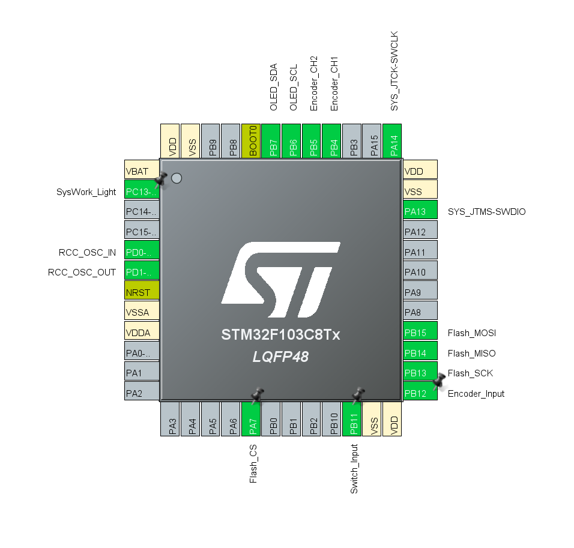
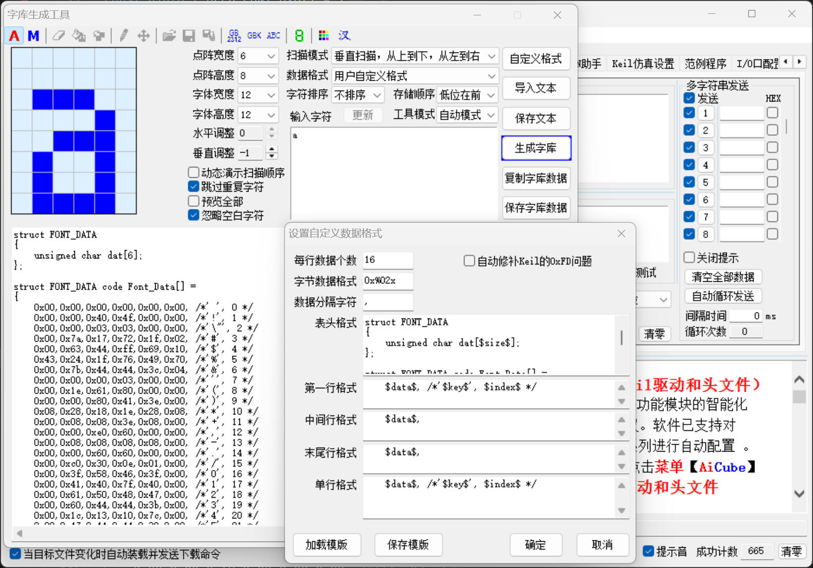
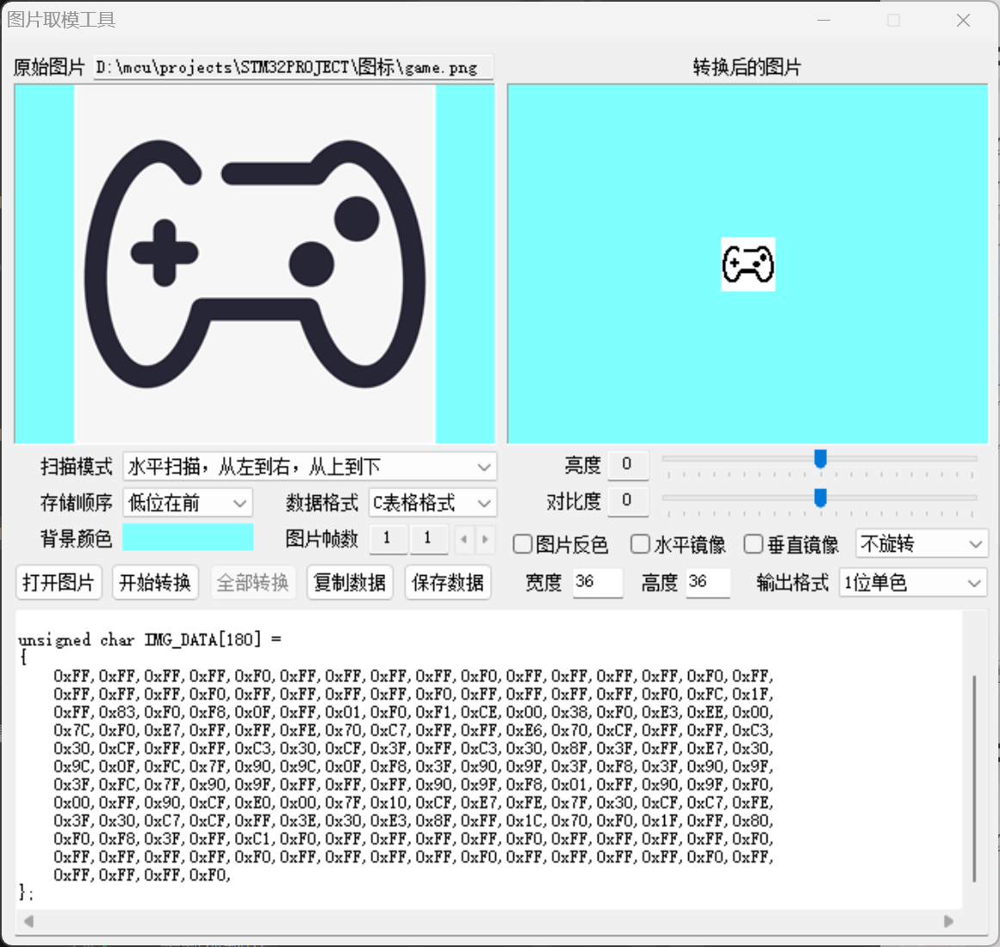

# これは我的第一个STM工程(写的很糟见谅233)！
- __(特色)支持像lua一样的tween补全,他们的语法相似(而且有逻辑判断可以在while里面被调用!不会造成多次触发Tween导致的不正常)__
- __目前支持贪吃蛇、2048游戏、视频播放功能 还有部分菜单功能__
- __支持多级菜单__

## 型号和设计
- 使用STM的CUBEIDE配置的底层代码(型号为STM32C8T6)
- OLED配置是SSD1315|SSD1306，分辨率是128X64
- OLED的ui部分还需要灵感来发挥tween的强大233
- 使用C语言来完成
- 目前ui部分已经基本完工
- _爆吃61.29kb flash233_
- 

## OLED视频格式的要求
- 如果你想要oled播放视频，那你就得需要flash模块！(64kb flash实在难以发挥)
- #### Flash格式:
1. 在BasicAddr之后需要一个int来指示pointer的总数目
2. 紧接着int后面是pointer的数组(uint32_t)
3. pointer之后是你的视频data

- 注意pointer是指向某一帧的地址
- pointer的目的是为了能够轻松实现快进、快退功能
- 通过更改BasicAddr就可以做到换视频
- _建议使用ESP32S3来烧录flash_

## 关于OLED的字体设置&生成
- _这里比较推荐使用stc-isp自带的词库生成工具_
- 个别字体(比如 y g 这种字母)需要单独配置
- 

## 关于ICON的生成与格式
- _这里比较推荐使用stc-isp自带的图片取模工具_
- 目前所有的ICON分辨率是36x36
- 扫描模式是水平扫描、从左往右、从上往下
- 

## 实物图！
- 

## 实物展示视频
- 录制视频中.....(后续应该会上b站)

## 后续
- 极有可能会画一个pcb板子并打板测试
- 先挂个工程放这里后续发展用2333