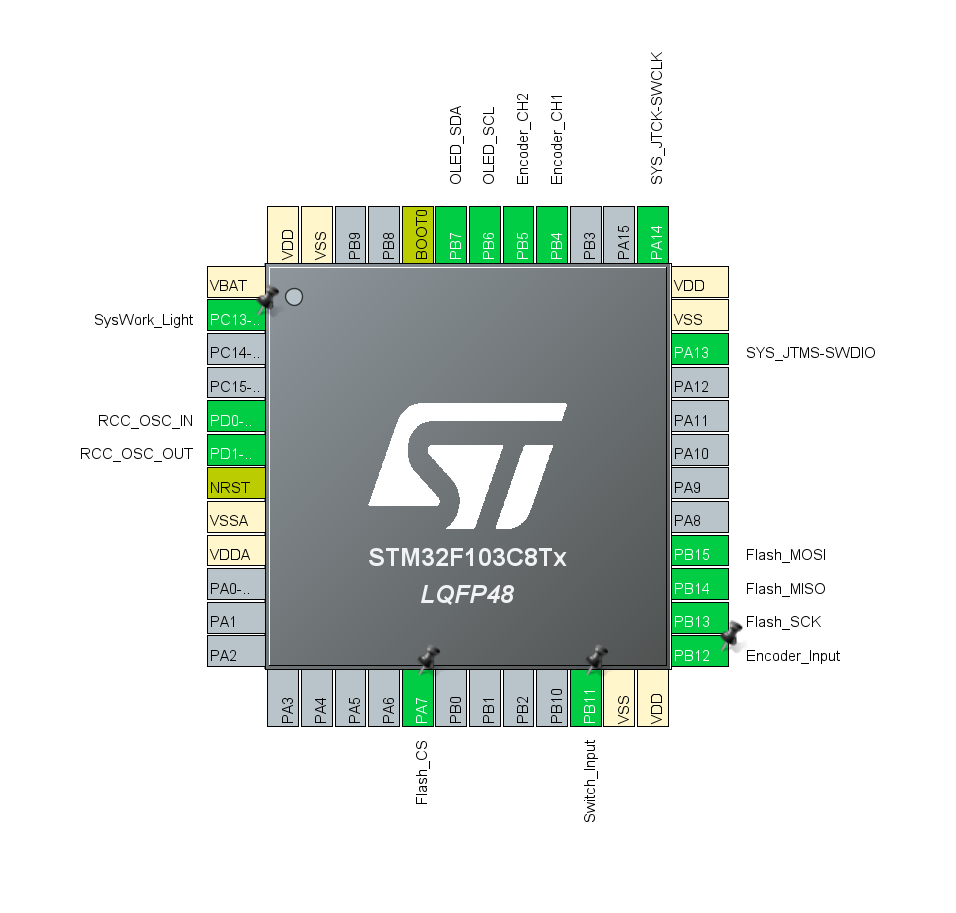
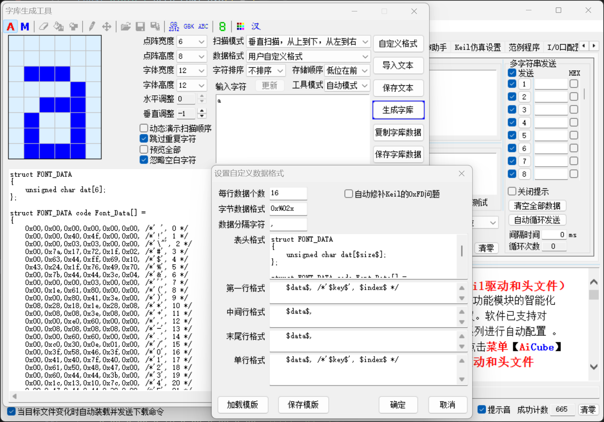
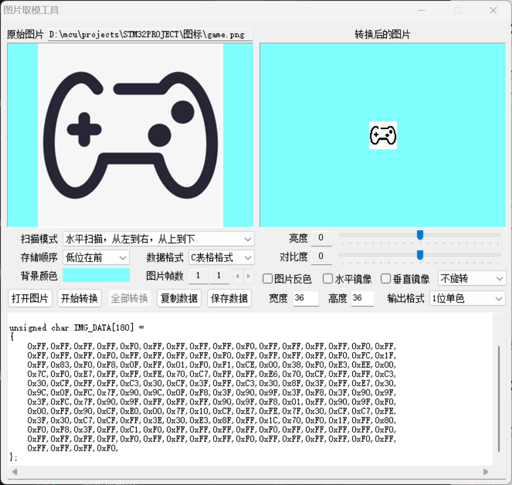

# これは我的第一个STM工程(写的很糟见谅233)！
- __(特色)支持像lua一样的tween补全,他们的语法相似(而且有逻辑判断可以在while里面被调用!不会造成多次触发Tween导致的不正常)__
- __目前支持贪吃蛇、2048游戏、视频播放功能 还有部分菜单功能__
- __支持多级菜单__

## 型号和设计
- 使用STM的CUBEIDE配置的底层代码(型号为STM32C8T6)
- OLED配置是SSD1315|SSD1306，分辨率是128X64
- 使用C语言来完成
- ui部分已经基本完工(可供参考)
- _目前使用了15.95K RAM, 52.81K Flash_
- 

## OLED视频格式的要求
- 如果你想要oled播放视频，那你就得需要flash模块！(64KB flash实在难以发挥)
- #### Flash格式:
1. 在BasicAddr之后需要一个int来指示pointer的总数目
2. 紧接着int后面是pointer的数组(uint32_t)
3. pointer之后是你的视频data

- 注意pointer是指向某一帧的地址
- pointer的目的是为了能够轻松实现快进、快退功能
- 通过更改BasicAddr就可以做到换视频
- _建议使用ESP32S3来烧录flash_

## 关于OLED的字体设置&生成
- _这里比较推荐使用stc-isp自带的词库生成工具_
- 个别字体(比如 y g 这种字母)需要单独配置
- 生成的字体请放在/Core/Src/oled.c里(替换掉原有的)
- 如果想要多个字体,可以使用相同的格式的代码放在/Core/Inc/oledfont.h里面,这是个保留文件,需要自己调用
- 

## 关于ICON的生成与格式
- _这里比较推荐使用stc-isp自带的图片取模工具_
- 目前所有的ICON分辨率是36x36
- 扫描模式是水平扫描、从左往右、从上往下
- 生成的图片请放在/Core/Src/icon.c文件里,然后再在头文件中定义,使用    OLED_DrawIcon()来显示你的图片！
- 

## 实物图
- 

## 实物展示视频
- #### [视频展示(BiliBili)](https://www.bilibili.com/video/BV1xy7mzzEvP)

## 后续
- 已画pcb板，正在打板测试
- pcb工程放在了/LCED_PCB里面,文件夹有些许备份部分,如想使用,请使用最新日期的版本

#### 第一版PCB展示图(已经验证成功)
- 
- _处女板,很菜轻喷qwq_
- 感谢[ＦＵＷＡＫＩ](https://github.com/Fuwaki)的指导

## 后言
- _请先让我顺利通过期末考试月_
- _(考完力2025/6/30)_

## 下一个项目出来了! [点击这里跳转](https://github.com/UnikoZera/STM_IPS)
__FEATURES:__
- 有着更加丰富的功能和更好的性能表现,欢迎大家前往观看!
- 有上位机软件,可以通过串口发送指令来控制OLED显示内容,还支持多种动画效果!
- 还有全新的结构框架,更易于维护和扩展!